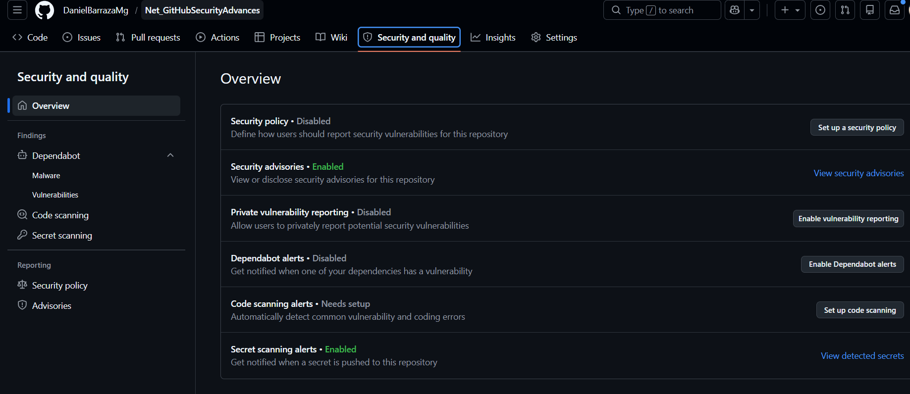
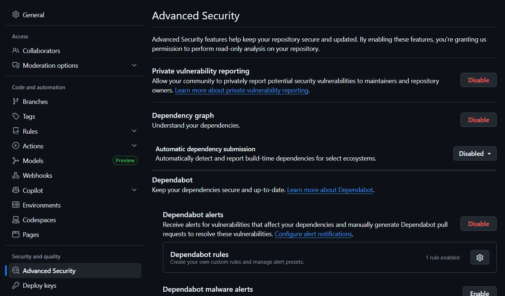
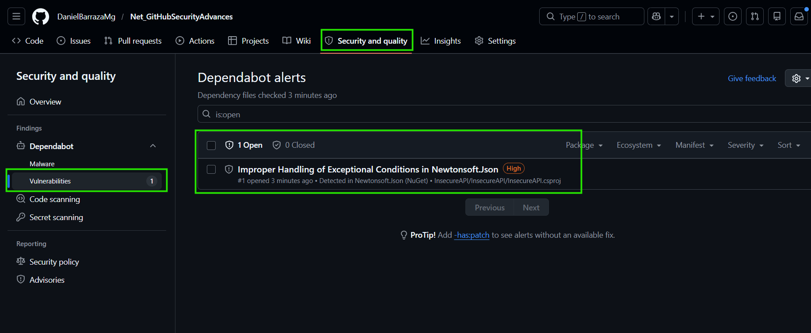

# Net_GitHubSecurityAdvances
Prueba de concepto de Git Hub Securtiry Advanced

## Objetivo

Este repositorio tiene como objetivo demostrar las capacidades de seguridad de GitHub para la detección temprana de vulnerabilidades en aplicaciones .NET

La aplicación contiene vulnerabilidades intencionales para validar el funcionamiento de las distintas herramientas de análisis de seguridad

---

# Capacidades evaluadas

Todos los proyectos tienen un apartado "Security and Quality", donde vamos a poder ver diferentes apartados



## 1. Security Policy

### ¿Qué es?

Es un document que define el proceso oficinal para reportar vulnerabilidades de seguridad encontradas en el repositorio.

Normalmente se implementa mediante un archivo ``.github/SECURITY.md``

Cuando existe, GitHub agrega automáticamente un enlace visible en la sección Security del repositorio

### ¿Qué problema resuelve?

Cuando alguien encuentra una vulnerabilidad, necesita saber:
- A quién reportarla
- Cómo reportarla
- Qué información entregar
- Qué tiempos de respuesta esperar

## 2. Security Advisories

### ¿Qué es?

Permite registrar, investigar, coordinar y publicar vulnerabilidades de seguridad detectadas en el repositorio

### ¿Qué problema resuelve?

Cuando encuentras una vulnerabilidad importante, normalmente necesitas:

- Documentarla.
- Analizar su impacto.
- Coordinar una corrección.
- Mantener la información privada mientras se trabaja en la solución.
- Publicarla cuando ya esté corregida.

Security Advisories proporciona ese flujo.

## 3. Private Vulnerability Reporting

### ¿Qué es?

Permite que cualquier persona reporte una vulnerabilidad de forma privada al equipo mantenedor del repositorio

En lugar de abrir un Issue público, GitHub crea automáticamente un reporte privado de seguridad.

### ¿Qué problema resuelve?

Imagina que alguien encuentra una vulnerabilidad crítica.

Sin esta funcionalidad podría:

- Abrir un Issue público.
- Exponer detalles de explotación.
- Publicar credenciales accidentalmente.
- Alertar a posibles atacantes antes de corregir el problema.

Private Vulnerability Reporting evita eso.

## 4. Dependabot Alerts

### ¿Qué es?

Detecta dependencias vulnerables dentro del proyecto
En una API.NET, revisa los paquetes NuGet declarados en archivos como: ``.csproj``
y los comparar contra la base de vulnerabilidades conocida de GitHub

### ¿Qué problema resuelve?

Muchas vulnerabilidades no están en tu código, sino en librerías externas

Por ejemplo
````xml
<PackageReference Include="Newtonsoft.Json" Version="12.0.3" />
````

Aunque tu código esté bien escrito, si usas una versión vulnerable, la aplicación hereda ese riesgo.

## 5. Code scanning alerts

### ¿Qué es?

Es la evoulución natural de Dependabot Alerts. Mienstra que Dependabot te dice que dependencias son vulnerables, Dependabot Security Updates te dice "Ya preparé el Pull Request para corregirla"

### ¿Qué problema resuelve?

Dependabot Security Updates automatiza gran parte de ese trabajo. GitHub modifica automáticamente 

De:
````xml
<PackageReference Include="Newtonsoft.Json" Version="12.0.3" />
````

A:
````xml
<PackageReference Include="Newtonsoft.Json" Version="13.0.1" />
````


## 6. Secret scanning alerts

### ¿Qué es?

Analiza tu código fuente buscando vulnerabilidades, malas prácticas y errores de seguridad.

En GitHub normalmente se implementa utilizando ``CodeQL`` que es el motor de análisis estático desarrollado por GitHub

### ¿Qué problema resuelve?

A diferencia de Dependabot, que analiza librerías externas, Code Scanning analiza el código que escribieron los desarrolladores.

Busca cosas como:

- SQL Injection
- Command Injection
- Path Traversal
- Hardcoded credentials
- SSRF
- XSS
- Insecure deserialization
- Uso inseguro de criptografía
- Fugas de información

# Resultados de las pruebas

## Dependabot

Al activar dependabot, nos redirige a la sección "Settings / Advanced Security" del repositorio. 
Acá podemos activar solo alertas, generación de PR automaticamente, y generación de PRs con las últimas versiones de las librerías.



Una vez activado, si volvemos a la sección "Security and Quality", podemos ver que ya existe una alerta de vulnerabilidad por la librería "NewtonSoft"



## Code scanning alerts

Al presionar el botón "Set up code scanning", nos redirige a la sección "Settings / Advanced Security" del repositorio, específicamente al apartado "Code Scanning"
